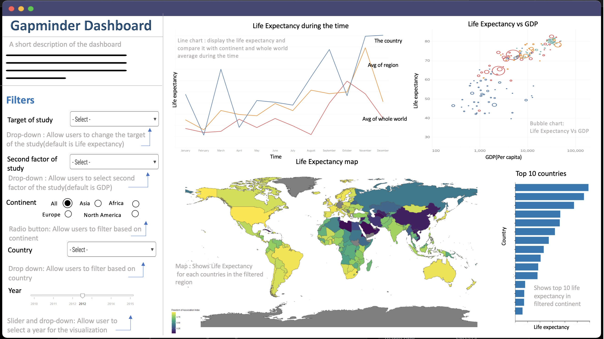

# Gapminder dashboard


## Description of the app

The Gapminder dataset is a great source of information to learn about the world. The main objective of this app is to investigate what the young population of students know and don’t know about basic global patterns and macro-trends and educate the intended users on global development trends. This dashboard has been developed to communicate insights about historical social/economic trends and create a better understanding of using and teaching statistics.

The landing page of the dashboard is designed to have a panel of five filters for which users can interact with. These filters include selecting a primary and secondary target to study, a continent, a country and the year range of interest (1960 to 2018). The line chart is a trend-plot showing the change of the primary target of the study over the time interval for a selected country. It also includes the average of the continent and average of the whole world which gives users the ability to compare trends.
Additionally we include a bubble chart which visualizes the target study versus the second factor of study for all the countries.

The global map is presented at the bottom of the dashboard with a tooltip for each country. After choosing a continent in the filter section, the selected continent should be highlighted and the colour gradient will dictate the values of the target of study within that region. To the right of the global map, a bar plot will show the top ten countries with highest value for the selected target of study.

## Useful link

- 📊 [Dashboard Link](https://dsci532-2022-gapminder-app.herokuapp.com/)
- [Github Repo](https://github.com/UBC-MDS/gapminder_dashboard)
- 🗺 [Gapminder website](https://www.gapminder.org/)

## Dashboard Sketch Design



## Usage and Installation

### Clone the repo

```
git clone https://github.com/UBC-MDS/gapminder_dashboard.git
```

Navigate to the folder and install via the method of preference:

### Install via pip

```bash
pip install -r requirements.txt
```

### Install with Conda environment

```bash
conda create --name gapminder --file requirements.txt
```

Then run the following command:

```bash
python src/app.py
```

### Install with [Docker](https://www.docker.com/)

```
docker-compose up
```

Navigate to [http://127.0.0.1:8050/](http://127.0.0.1:8050/) in your chosen browser.

## Contributing

Interested in contributing? Check out the contributing guidelines. Please note that this project is released with a Code of Conduct. By contributing to this project, you agree to abide by its terms.

For this project, we used `Dash` for dashboarding, `Altair` for charts, and `Heroku` for deployment. Please follow the `Usage and Installation` to install and run the app locally.

## Contributors

This app was developed by the following Master of Data Science program candidates at the University of the British Columbia:

- Mel Liow                [@mel-liow](https://github.com/mel-liow)
- Anupriya Srivastava     [@Anupriya-Sri](https://github.com/Anupriya-Sri)
- Mohammadreza Mirzazadeh [@rezam747](https://github.com/rezam747)
- Arijeet CHATTERJEE      [@arijc76](https://github.com/arijc76)

## License

`gapminder_dashboard` was created by Mel, Anupriya, Reza and Arijeet. It is licensed under the terms of the MIT [license](https://github.com/UBC-MDS/gapminder_dashboard/blob/main/LICENSE).
